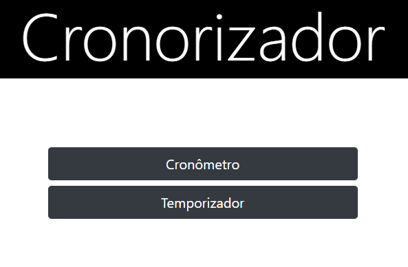
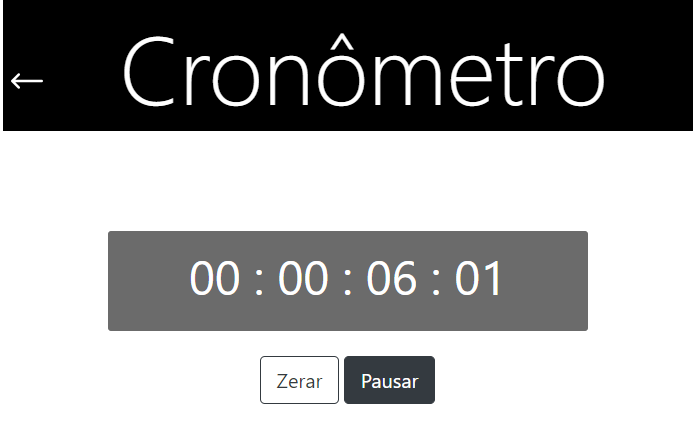
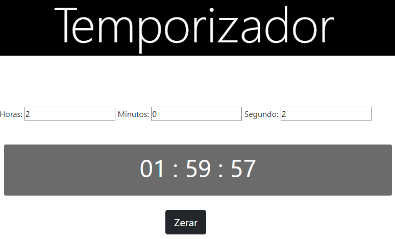

 

# cronometro
conometro é projeto de treinamento de funções do Java Script.

## Índice
* [Tech](#tecnologias)
* [Screenshots](#screenshots)

## Sobre o projeto

<a href="https://allanvigiani.github.io/instagram-cronometro/">Clique aqui</a> para ver o projeto.

	
## Tecnologias
- HTML5
- CSS3
- JS

## Screenshots

